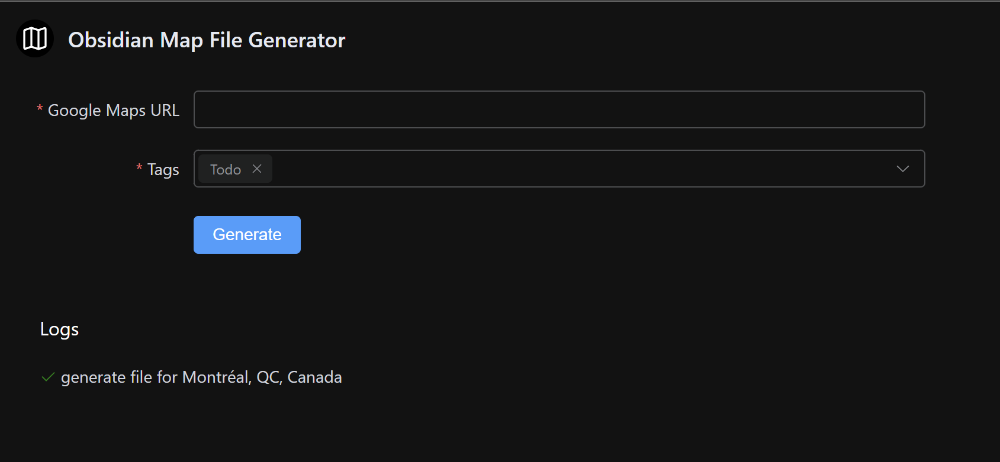

# Obsidian Map File Generator

A quick and dirty project to generate a markdown file for the Obsidian plugin MapView from a Google Maps url.

## Screenshot



## How to use it

```
git clone https://github.com/Gyskard/obsidian-map-file-generator
npm install
npm run dev
```

## Built With

* VueJS
* Pinia
* ElementPlus

